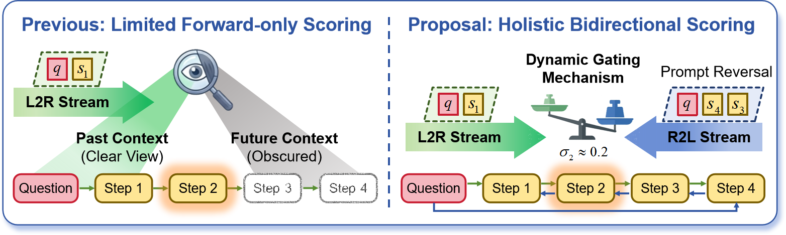
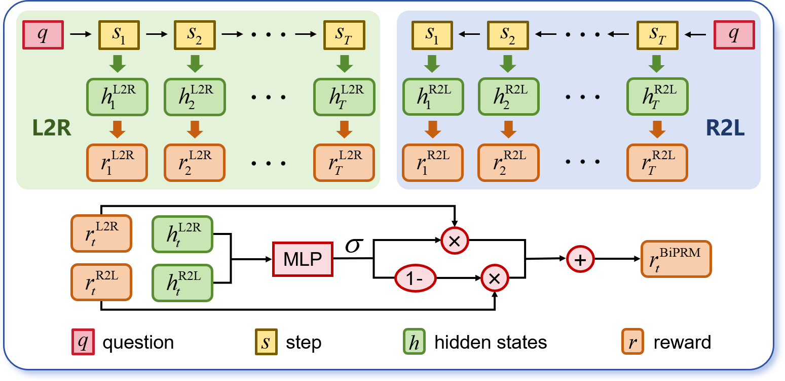

# BiPRM: The Bidirectional Process Reward Model

> 🎉 **News (2026/04/07):** Our paper has been accepted to **ACL 2026 Main Conference**!
>
> 📄 **Paper:** [The Bidirectional Process Reward Model (arXiv:2508.01682)](https://arxiv.org/abs/2508.01682)


## 💡 Introduction

<p align="center">
  
  <br>
  <em>Figure 1: Comparison of the conventional L2R evaluation paradigm and our holistic bidirectional scoring approach.</em>
</p>

Process Reward Models (PRMs) have emerged as a promising approach to enhance the reasoning quality of Large Language Models (LLMs) by assigning fine-grained scores to intermediate reasoning steps. However, most existing PRMs rely on a unidirectional **left-to-right (L2R)** evaluation scheme, which inherently restricts their ability to leverage global context.

To address this, we propose **BiPRM**, a novel bidirectional evaluation paradigm designed specifically for scoring **known reasoning trajectories** rather than real-time search guidance. By synthesizing future deductive steps with past context, BiPRM provides a robust, globally consistent evaluation. 

<p align="center">
  
  <br>
  <em>Figure 2: Overview of the BiPRM Architecture, featuring the dynamic gating mechanism.</em>
</p>

Our approach introduces three core advantages:
- **Parallel Dual-Stream Evaluation:** BiPRM incorporates a parallel **right-to-left (R2L)** evaluation stream (via prompt reversal) alongside the conventional L2R flow to effectively verify logical consistency.
- **Dynamic Gating Mechanism:** A lightweight dynamic gating module (only **+0.3%** parameters) adaptively fuses the forward and backward reward scores based on reasoning progress.
- **High Efficiency:** Thanks to parallel execution, BiPRM incurs only **~5%** inference latency overhead while significantly boosting verification accuracy.

BiPRM achieves an average relative gain of **10.6%** over 54 solution-level configurations and **37.7%** in step-level error detection scenarios.

---

## 📁 Repository Structure

```
BiPRM-main/
├── README.md
├── requirements.txt
├── config/
│   └── config.json                 # Training hyper-parameters & DeepSpeed config
├── accelerate_configs/
│   └── deepspeed_3.json            # DeepSpeed ZeRO-3 config
├── train_biprm.py                  # Training entry point
├── eval_solution_level_biprm.py    # Best-of-N (solution-level) evaluation
├── eval_step_level_biprm.py        # ProcessBench (step-level) evaluation
├── eval_solution_level_utils.py    # Eval helpers (eval_gsm8k / eval_math_prm)
├── value_model.py                  # Causal LM with value head (forked from TRL)
├── training_arguments.py           # Custom HF TrainingArguments
├── utils.py                        # Bidirectional dataset construction
├── grader.py                       # MATH-style equivalence checker
└── normalizer.py                   # Answer normalization helpers
```

---

## 🛠️ Environment Setup

We recommend Anaconda. The codebase has been tested on Linux with NVIDIA GPUs (CUDA 11.8).

```bash
conda create -n biprm python=3.10
conda activate biprm

# Install PyTorch (matched with CUDA 11.8)
pip install torch==2.3.1+cu118 --index-url https://download.pytorch.org/whl/cu118

# Install required dependencies
pip install -r requirements.txt
```

---

## 📚 Dataset Preparation

### Training data — Math-Shepherd

We use the [Math-Shepherd](https://huggingface.co/datasets/trl-lib/math_shepherd) dataset.
Set `train_file` in `config/config.json` to `trl-lib/math_shepherd` (auto-downloads from the Hugging Face Hub) or to a local path.

### Evaluation data

| Stage                     | Dataset                                                      | How to obtain           |
| ------------------------- | ------------------------------------------------------------ | ----------------------- |
| Solution-level (GSM-Plus) | [`qintongli/GSM-Plus`](https://huggingface.co/datasets/qintongli/GSM-Plus) | auto-downloaded from HF |
| Solution-level (MATH-500) | [`HuggingFaceH4/MATH-500`](https://huggingface.co/datasets/HuggingFaceH4/MATH-500) | auto-downloaded from HF |
| Step-level (ProcessBench) | [`Qwen/ProcessBench`](https://huggingface.co/datasets/Qwen/ProcessBench) | auto-downloaded from HF |

For the **solution-level** evaluation you additionally need a JSON file containing **128 candidate solutions** per question. Place it under `./test_data/`:

```
test_data/
├── gsm8k-plus-muggle-128.json
├── gsm8k-plus-metamath-mistral-128.json
├── gsm8k-plus-llama3-70b-inst-128.json
├── math-muggle-128.json
├── math-metamath-mistral-128.json
└── math-llama3-70b-inst-128.json
```

Each file is a list of objects:
```json
[
  {
    "question": "...",
    "responses": [
      {"text": "Step 1: ... \\boxed{...}", "model_name": "..."},
      ... (128 items in total)
    ]
  },
  ...
]
```

---

## 🚀 Training

`train_biprm.py` supports various LLM backbones (Qwen2.5-Math, DeepSeek-Math, Rho-Math, ...) by editing `config/config.json`. The script automatically extracts bidirectional hidden states, feeds them into a 2-layer MLP to produce the dynamic gate `sigma`, and fuses forward / backward rewards.

Launch distributed training with DeepSpeed ZeRO-3:

```bash
deepspeed train_biprm.py ./config/config.json
```

You can switch the backbone, loss objective (`bce` / `mse` / `rank`), or any HF `TrainingArguments` by editing `config/config.json`.

After training, the trained checkpoint is saved as `pytorch_model.bin` (containing the backbone + value head + `sigma_mlp`) under the configured `output_dir`.

---

## 🧪 Evaluation

We evaluate the trained BiPRM at both the **solution level** (Best-of-N) and the **step level** (first-error localization).

### 1. Solution-level (Best-of-N) Evaluation

```bash
deepspeed eval_solution_level_biprm.py \
    --backbone-path=Qwen/Qwen2.5-Math-1.5B \
    --model-path=./ckpt_biprm/qwen_bce/checkpoint \
    --data-name=gsm8k \
    --data-file=./test_data/gsm8k-plus-muggle-128.json \
    --save-file=./eval_solution_level/qwen_bce/biprm_gsm8k-plus-muggle.json
```

Key arguments:

| Argument          | Description                                                  |
| ----------------- | ------------------------------------------------------------ |
| `--backbone-path` | HF path / local dir of the base LLM (must match the backbone used at training time) |
| `--model-path`    | Folder containing the trained `pytorch_model.bin`            |
| `--data-name`     | `gsm8k` or `math`                                            |
| `--data-file`     | Best-of-N candidate file (see *Dataset Preparation*)         |
| `--save-file`     | Output JSON with per-candidate rewards                       |

The script reports BoN accuracy at `n ∈ {1, 8, 16, 32, 64, 128}`.

### 2. Step-level Evaluation (ProcessBench)

```bash
deepspeed eval_step_level_biprm.py \
    --backbone-path Qwen/Qwen2.5-Math-1.5B \
    --model-path ./ckpt_biprm/qwen_bce/checkpoint \
    --subset gsm8k \
    --output-dir ./eval_step_level/qwen_bce/biprm_gsm8k
```

Key arguments:

| Argument       | Description                                                  |
| -------------- | ------------------------------------------------------------ |
| `--subset`     | ProcessBench subset (`gsm8k` / `math` / `olympiadbench` / `omnimath`) |
| `--threshold`  | Score below which a step is treated as an error (default `0.5`) |
| `--tp-size`    | Tensor-parallel size used by `deepspeed.init_inference`      |
| `--output-dir` | Where the per-sample predictions (`*_error.jsonl`, `*_correct.jsonl`) are written |

The script prints **error-acc / correct-acc / F1** for each subset.

---

## 📝 Citation

If this repository or our paper is useful for your research, please cite:

```bibtex
@article{zhang2025bidirectional,
  title   = {The Bidirectional Process Reward Model},
  author  = {Zhang, Lingyin and Gao, Jun and Ren, Xiaoxue and Cao, Ziqiang},
  journal = {arXiv preprint arXiv:2508.01682},
  year    = {2025}
}
```

---

## 🙏 Acknowledgements

The value-head module (`value_model.py`) is adapted from [HuggingFace TRL](https://github.com/huggingface/trl). Evaluation utilities (`grader.py`, `normalizer.py`) follow the [MATH](https://github.com/hendrycks/math) and [Math-Shepherd](https://github.com/peiyi9979/Math-Shepherd) conventions.

